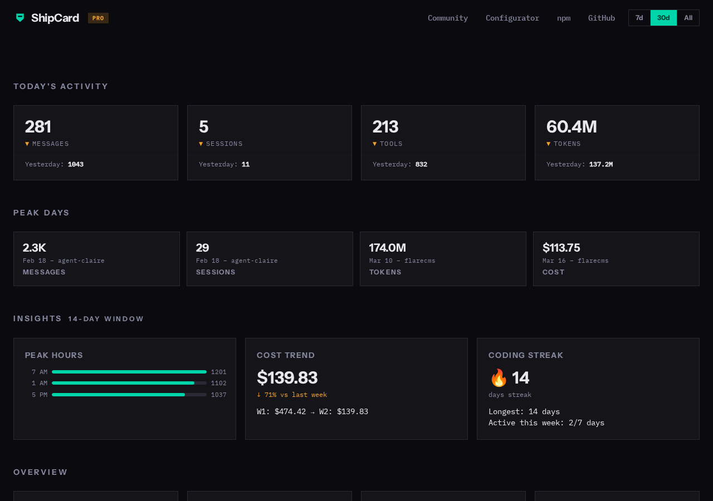

<p align="center">
  
</p>

<p align="center">
  <strong>Your Claude Code stats, in one card.</strong>
</p>

<p align="center">
  <a href="https://www.npmjs.com/package/@jjaimealeman/shipcard"></a>
  <a href="https://github.com/jjaimealeman/shipcard/blob/main/LICENSE"></a>
  <a href="https://shipcard.dev"></a>
</p>

<p align="center">
  
</p>

---

One command parses your Claude Code sessions and generates an embeddable SVG stats card. Embed it in your README, portfolio, or dotfiles.

<p align="center">
  
</p>

## Quick Start

```sh
npx @jjaimealeman/shipcard summary
```

Or install globally:

```sh
npm install -g @jjaimealeman/shipcard

shipcard summary          # terminal overview
shipcard costs            # cost breakdown by project and model
shipcard card --local     # generate SVG card
shipcard login            # authenticate with GitHub
shipcard sync --confirm   # push stats to shipcard.dev
shipcard slug create      # custom card URLs (PRO)
```

---

## Embed Your Card

After syncing, add this to your README:

```markdown

```

With a theme:

```markdown

```

**9 curated themes:** catppuccin, dracula, tokyo-night, nord, gruvbox, solarized-dark, solarized-light, one-dark, monokai

Customize at [shipcard.dev/configure](https://shipcard.dev/configure) or pass query params directly:

```
?theme=dracula&layout=hero&style=branded
```

---

## MCP Config

Ask Claude about your coding stats from inside Claude Code:

```json
{
  "mcpServers": {
    "shipcard": {
      "command": "npx",
      "args": ["-y", "-p", "@jjaimealeman/shipcard", "shipcard-mcp"]
    }
  }
}
```

Add to `.claude/settings.json` (project) or `~/.claude/settings.json` (global). Then use tools `shipcard:summary`, `shipcard:costs`, and `shipcard:card` in any conversation.

**Example conversations:**

```
❯ how many sessions have I had this month?

● 226 sessions this month, ~$1,977.81 in estimated cost.
  That's a busy March.
```

```
❯ compare march to february?

● ┌──────────┬────────────┬────────────┐
  │          │  February  │   March    │
  ├──────────┼────────────┼────────────┤
  │ Sessions │ 264        │ 226        │
  ├──────────┼────────────┼────────────┤
  │ Cost     │ ~$1,519.69 │ ~$1,977.81 │
  └──────────┴────────────┴────────────┘

  Fewer sessions in March but $458 more expensive —
  heavier models (Opus) this month.
```

---

## CLI

| Command | What it does |
|---------|-------------|
| `shipcard summary` | Sessions, tokens, cost, models, tool call counts |
| `shipcard costs` | Cost breakdown by project and model |
| `shipcard card` | Generate SVG card (`--local`) or preview JSON |
| `shipcard login` | Authenticate via GitHub device flow |
| `shipcard sync` | Push stats to cloud, get embeddable URL |
| `shipcard slug` | Manage custom card URL slugs (PRO) |

See [USAGE.md](USAGE.md) for full flag reference.

---

## Features

**Free:**
- Local CLI + MCP server
- 9 curated themes, 3 layouts, 3 styles
- Cloud sync with embeddable card URL
- Analytics dashboard with 9 chart panels
- Community leaderboard

**PRO ($2/mo):**
- Custom colors (BYOT — bring your own theme)
- Custom URL slugs (`/u/you/dark-minimal`)
- PRO badge on card
- AI coding insights (peak hours, cost trends, streaks)
- Priority cache refresh

---

## Data Availability

ShipCard parses Claude Code JSONL files from approximately **January 2026 onward**. Earlier sessions used a different schema that lacks the fields ShipCard needs.

---

## Links

- [shipcard.dev](https://shipcard.dev) — landing page
- [shipcard.dev/community](https://shipcard.dev/community) — leaderboard
- [shipcard.dev/configure](https://shipcard.dev/configure) — card configurator
- [USAGE.md](USAGE.md) — full CLI + MCP reference

---

MIT License · Built on Cloudflare · Made in El Paso
